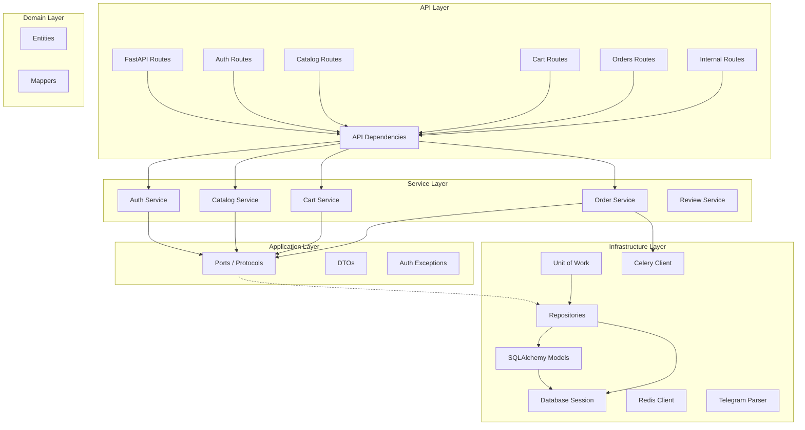

# 🍃 LeafFlow

[](https://www.python.org/downloads/)
[](https://fastapi.tiangolo.com/)
[](https://www.postgresql.org/)
[](https://redis.io/)
[](LICENSE)

**LeafFlow** — бэкенд для чайного интернет-магазина, построенный на FastAPI с использованием принципов **Hexagonal Architecture (Ports & Adapters)** и **Domain-Driven Design**.  
Полнофункциональное решение «от листа до корзины» с интеграцией Telegram, системой заказов и гибким каталогом продуктов.

---

## 📋 Содержание

- [Особенности](#-особенности)
- [Технологический стек](#-технологический-стек)
- [Архитектура](#-архитектура)
- [Требования](#-требования)
- [Установка](#-установка)
  - [Локальная установка](#локальная-установка)
  - [Установка через Docker Compose](#установка-через-docker-compose)
- [Конфигурация](#-конфигурация)
- [Запуск](#-запуск)
  - [Локальный запуск](#локальный-запуск)
  - [Запуск через Docker](#запуск-через-docker)
- [Работа с БД](#-работа-с-бд)
  - [Миграции Alembic](#миграции-alembic)
  - [Деактивация продуктов и очистка корзин](#-деактивация-продуктов-и-очистка-корзин-на-уровне-postgresql)
- [API Documentation](#-api-documentation)
- [Структура проекта](#-структура-проекта)
- [Модули и функциональность](#-модули-и-функциональность)
- [Разработка](#-разработка)
- [Best Practices](#-best-practices)
- [Contributing](#-contributing)
- [Лицензия](#-лицензия)

---

## ✨ Особенности

### Ядро
- 🚀 **Асинхронная архитектура** — полностью `async/await` с FastAPI и SQLAlchemy 2.0
- 🏗️ **Hexagonal Architecture** — Ports & Adapters с использованием `typing.Protocol`
- 🔄 **Unit of Work паттерн** — управление транзакциями и консистентностью данных
- 📦 **CQRS-lite** — разделение Reader/Writer интерфейсов для репозиториев
- 🎯 **Dependency Inversion** — бизнес-логика зависит только от абстракций (протоколов)

### Каталог и продукты
- 🍵 **Гибкая система продуктов** — категории, теги, варианты (вес/цена), профили заваривания
- 🏷️ **Динамические атрибуты** — настраиваемые характеристики товаров с различными UI-хинтами
- 🖼️ **Медиа-файлы** — загрузка и хранение изображений товаров

### Аутентификация
- 📱 **Telegram Mini App** — авторизация через initData
- 🔐 **Telegram Login Widget** — авторизация через виджет на сайте
- 📧 **Email/Password** — классическая регистрация и вход
- 🔗 **Связывание аккаунтов** — объединение Telegram и Email-аккаунтов с переносом заказов
- 🎫 **JWT токены** — access + refresh токены с ротацией

### E-commerce
- 🛒 **Корзина** — добавление, обновление, удаление позиций
- 📦 **Заказы** — оформление с выбором способа доставки (самовывоз, курьер, СДЭК)
- 📊 **Статусы заказов** — полный жизненный цикл (created → processing → paid → fulfilled)
- ⭐ **Отзывы** — агрегация отзывов с внешних платформ (Яндекс, Google, Telegram, Avito)

### Инфраструктура
- 📨 **Уведомления** — фоновые задачи через Celery + Redis
- 🐳 **Docker** — полная контейнеризация с nginx reverse proxy
- ⚙️ **Пул соединений** — настраиваемый пул подключений к PostgreSQL

---

## 🛠 Технологический стек

| Категория          | Технологии                          |
|--------------------|-------------------------------------|
| **Framework**      | FastAPI 0.118.3                     |
| **Language**       | Python 3.12+                        |
| **Database**       | PostgreSQL 17 + asyncpg             |
| **ORM**            | SQLAlchemy 2.0 (async)              |
| **Migrations**     | Alembic                             |
| **Validation**     | Pydantic v2                         |
| **Auth**           | JWT (PyJWT) + bcrypt                |
| **Cache/Queue**    | Redis 7 + Celery 5.4                |
| **HTTP Client**    | httpx                               |
| **Server**         | Uvicorn / Gunicorn                  |
| **Reverse Proxy**  | nginx                               |
| **Containerize**   | Docker, Docker Compose              |

---

## 🏛 Архитектура

Проект следует принципам **Hexagonal Architecture (Ports & Adapters)** и **Domain-Driven Design**.



### Слои приложения

| Слой               | Назначение                                        | Компоненты                                             |
|--------------------|---------------------------------------------------|--------------------------------------------------------|
| **API**            | HTTP endpoints, роутинг, валидация                | `auth`, `app`, `internal` роутеры и схемы              |
| **Services**       | Бизнес-логика приложения                          | `auth_service`, `cart_service`, `order_service`, ...   |
| **Application**    | Порты (интерфейсы), DTO, исключения               | `ports/`, `dto/`, `auth/exceptions.py`                 |
| **Infrastructure** | Реализация портов, БД, Redis, внешние интеграции  | UoW, Repositories, Celery, Telegram parser             |
| **Domain**         | Доменные сущности, маппинг ORM → Entity           | `entities/`, `mappers/`                                |

### Ports & Adapters

Ключевая особенность архитектуры — использование `typing.Protocol` для определения интерфейсов (портов):

```python
# application/ports/user.py
from typing import Protocol

class UserReader(Protocol):
    async def get_by_id(self, user_id: int) -> UserEntity | None: ...
    async def get_by_email(self, email: str) -> UserEntity | None: ...

class UserWriter(Protocol):
    async def create(self, **kwargs) -> UserEntity: ...
    async def delete(self, user_id: int) -> None: ...
```

```python
# infrastructure/db/uow.py
@dataclass
class UoW:
    users_reader: UserReader      # ← Protocol, не конкретный класс
    users_writer: UserWriter
    orders_reader: OrderReader
    orders_writer: OrderWriter
    # ...
```

Это обеспечивает:
- **Dependency Inversion** — сервисы зависят от абстракций
- **Тестируемость** — легко подменять реализации моками
- **Гибкость** — можно менять инфраструктуру без изменения бизнес-логики

---

## 📦 Требования

- **Python:** 3.12 или выше  
- **PostgreSQL:** 17 (рекомендуется через Docker)  
- **Redis:** 7+ (для Celery и кэширования)
- **Docker / Docker Compose** (для production-развёртывания)

---

## 🚀 Установка

### Локальная установка

Клонируйте репозиторий:

```bash
git clone https://github.com/Mist3s/leaf-flow.git
cd leaf-flow
```

Создайте и активируйте виртуальное окружение:

```bash
python -m venv .venv

# macOS/Linux:
source .venv/bin/activate

# Windows PowerShell:
.venv\Scripts\Activate.ps1

# Windows CMD:
.venv\Scripts\activate.bat
```

Установите зависимости:

```bash
pip install -e .
```

> Флаг `-e` устанавливает проект в режиме разработки (*editable mode*).

### Установка через Docker Compose

```bash
docker-compose up -d
```

---

## ⚙️ Конфигурация

Приложение использует переменные окружения для конфигурации.

### Создание файла окружения

```bash
cp .env.example .env
```

### Параметры конфигурации

```env
# --- База данных ---
POSTGRES_USER=leafflow_user
POSTGRES_PASSWORD=strong_password_here
POSTGRES_DB=leafflow_db
DB_HOST=localhost
DB_PORT=5432

# --- Пул соединений ---
DB_POOL_SIZE=10
DB_MAX_OVERFLOW=20
DB_POOL_RECYCLE=300

# --- JWT ---
JWT_SECRET=your-super-secret-key
JWT_ALGORITHM=HS256
ACCESS_TOKEN_TTL_SECONDS=86400
REFRESH_TOKEN_TTL_SECONDS=1209600

# --- Telegram ---
TELEGRAM_BOT_TOKEN=your-telegram-bot-token

# --- Internal API ---
INTERNAL_BOT_TOKEN=internal-api-token
ADMIN_API_TOKEN=admin-api-token

# --- Медиа ---
IMAGES_DIR=static/images
IMAGES_BASE_URL=/images

# --- Уведомления ---
EXTERNAL_BOT_URL=https://your-notification-bot.com
EXTERNAL_BOT_TOKEN=notification-bot-token

# --- Redis ---
REDIS_HOST=localhost
REDIS_PORT=6379
```

### Таблица параметров

| Параметр                   | Описание                           | По умолчанию | Обязателен |
|----------------------------|------------------------------------|--------------|------------|
| `POSTGRES_USER`            | Имя пользователя PostgreSQL        | –            | ✅          |
| `POSTGRES_PASSWORD`        | Пароль пользователя                | –            | ✅          |
| `POSTGRES_DB`              | Имя базы данных                    | –            | ✅          |
| `DB_HOST`                  | Хост базы данных                   | –            | ✅          |
| `DB_PORT`                  | Порт базы данных                   | –            | ✅          |
| `DB_POOL_SIZE`             | Размер пула соединений             | `10`         | ❌          |
| `DB_MAX_OVERFLOW`          | Макс. дополнительных соединений    | `20`         | ❌          |
| `JWT_SECRET`               | Секрет для подписи JWT             | –            | ✅          |
| `TELEGRAM_BOT_TOKEN`       | Токен Telegram бота                | –            | ✅          |
| `INTERNAL_BOT_TOKEN`       | Токен для internal API             | –            | ✅          |
| `ADMIN_API_TOKEN`          | Токен для admin API                | –            | ✅          |
| `REDIS_HOST`               | Хост Redis                         | –            | ✅          |
| `REDIS_PORT`               | Порт Redis                         | –            | ✅          |

> **Важно:** Для Docker Compose используйте `DB_HOST=db-leaf-flow` и `REDIS_HOST=leaf-flow-redis`.

---

## 🏃 Запуск

### Локальный запуск

1. Запустите PostgreSQL и Redis:

```bash
docker-compose up -d db-leaf-flow leaf-flow-redis
```

2. Примените миграции:

```bash
alembic upgrade head
```

3. Запустите приложение:

```bash
python -m leaf_flow
```

Приложение будет доступно по адресу: `http://localhost:8000`

### Запуск через Docker

Полный стек включает:
- **leaf-flow** — основное API-приложение
- **leaf-flow-bot** — Telegram бот
- **leaf-flow-nginx** — фронтенд Telegram Mini App + API proxy
- **leaf-flow-web-nginx** — фронтенд веб-сайта + API proxy
- **leaf-flow-redis** — очередь задач
- **leaf-flow-notifications-worker** — воркер уведомлений
- **db-leaf-flow** — PostgreSQL

```bash
docker-compose up -d
```

API будет доступно через nginx на порту `5025`.

---

## 🗄️ Работа с БД

### Миграции Alembic

Создать новую миграцию:

```bash
alembic revision --autogenerate -m "описание изменений"
```

Применить миграции:

```bash
alembic upgrade head
```

Откатить миграцию:

```bash
alembic downgrade -1
```

Посмотреть историю миграций:

```bash
alembic history
```

### 🔒 Деактивация продуктов и очистка корзин (на уровне PostgreSQL)

В проекте реализована автоматическая поддержка консистентности каталога и корзины на уровне базы данных:

- При переводе `products.is_active` из `true` в `false`:
  - все варианты товара (`product_variants`) деактивируются (`is_active=false`);
  - все позиции в корзинах (`cart_items`), связанные с этим товаром, удаляются.

- При переводе `product_variants.is_active` из `true` в `false`:
  - все позиции в корзинах (`cart_items`), связанные с этим вариантом, удаляются;
  - если после этого у товара не осталось активных вариантов — товар автоматически деактивируется.

Данная логика реализована через `AFTER UPDATE` триггеры PostgreSQL.

---

## 📚 API Documentation

После запуска приложения доступна интерактивная документация:

- **Swagger UI:** `http://localhost:8000/api/docs`
- **ReDoc:** `http://localhost:8000/api/redoc`

---

## 📁 Структура проекта

```
leaf-flow/
├── .env.example              # Шаблон переменных окружения
├── alembic.ini               # Конфигурация Alembic
├── docker-compose.yml        # Docker Compose (production)
├── docker-compose-stage.yml  # Docker Compose (staging)
├── Dockerfile                # Docker образ приложения
├── pyproject.toml            # Зависимости и метаданные проекта
│
├── migrations/               # Миграции базы данных
│   ├── env.py
│   ├── prod/                 # Production миграции
│   ├── stage/                # Staging миграции
│   └── versions/             # Основные миграции
│
├── nginx/                    # Конфигурация nginx
│   ├── nginx.conf            # Production конфиг
│   └── nginx_stage.conf      # Staging конфиг
│
├── docs/                     # Документация
│   └── swagger.yaml          # OpenAPI спецификация
│
└── src/leaf_flow/            # Исходный код приложения
    ├── __init__.py
    ├── __main__.py           # Точка входа
    ├── app.py                # Инициализация FastAPI
    ├── config.py             # Настройки приложения
    │
    ├── api/                  # API слой
    │   ├── deps.py           # Общие зависимости (get_current_user, uow_dep)
    │   └── v1/
    │       ├── app/          # Основные endpoints
    │       │   ├── routers/
    │       │   │   ├── cart.py
    │       │   │   ├── catalog.py
    │       │   │   ├── order.py
    │       │   │   └── review.py
    │       │   └── schemas/
    │       ├── auth/         # Аутентификация
    │       │   ├── routers/
    │       │   │   ├── auth.py      # Email/Password auth
    │       │   │   └── telegram.py  # Telegram auth
    │       │   └── schemas/
    │       └── internal/     # Internal API (для ботов)
    │           ├── routers/
    │           └── schemas/
    │
    ├── application/          # Application слой (Ports & DTOs)
    │   ├── auth/
    │   │   └── exceptions.py # InvalidInitData, InvalidWidgetData
    │   ├── dto/
    │   │   ├── auth.py       # AuthTokens
    │   │   ├── notification.py
    │   │   └── telegram.py   # TelegramUserData
    │   └── ports/            # Интерфейсы (Protocols)
    │       ├── auth.py       # RefreshTokenReader/Writer
    │       ├── cart.py       # CartReader/Writer
    │       ├── category.py   # CategoryReader
    │       ├── order.py      # OrderReader/Writer
    │       ├── product.py    # ProductsReader
    │       ├── review.py     # ExternalReviewReader
    │       ├── support_topic.py
    │       └── user.py       # UserReader/Writer
    │
    ├── domain/               # Доменный слой
    │   └── entities/         # Доменные сущности (dataclasses)
    │       ├── auth.py
    │       ├── cart.py
    │       ├── category.py
    │       ├── order.py
    │       ├── product.py
    │       ├── review.py
    │       ├── support_topic.py
    │       └── user.py
    │
    ├── infrastructure/       # Инфраструктурный слой
    │   ├── db/
    │   │   ├── base.py       # Базовый класс моделей
    │   │   ├── session.py    # Настройка сессии БД
    │   │   ├── uow.py        # Unit of Work (типизирован протоколами)
    │   │   ├── mappers/      # ORM Model → Domain Entity
    │   │   ├── models/       # SQLAlchemy модели
    │   │   └── repositories/ # Реализации портов
    │   │       ├── cart.py   # CartReaderRepository, CartWriterRepository
    │   │       ├── order.py  # OrderReaderRepository, OrderWriterRepository
    │   │       ├── user.py   # UserReaderRepository, UserWriterRepository
    │   │       └── ...
    │   └── externals/
    │       ├── celery/
    │       │   ├── celery_client.py
    │       │   └── notification.py
    │       └── telegram/
    │           └── parser.py # parse_telegram_init_data, parse_telegram_widget_data
    │
    └── services/             # Сервисный слой (бизнес-логика)
        ├── auth_service.py
        ├── cart_service.py
        ├── catalog_service.py
        ├── order_service.py
        ├── review_service.py
        ├── security.py       # JWT, bcrypt, Telegram HMAC
        └── support_topic_service.py
```

---

## 🧩 Модули и функциональность

### Модели данных

| Модель                  | Описание                                        |
|-------------------------|-------------------------------------------------|
| `User`                  | Пользователь (Telegram/Email)                   |
| `RefreshToken`          | Refresh-токены для ротации                      |
| `Category`              | Категории товаров                               |
| `Product`               | Продукты с описанием, изображением, тегами      |
| `ProductVariant`        | Варианты продукта (вес, цена)                   |
| `ProductAttribute`      | Динамические атрибуты (вкус, эффект и т.д.)     |
| `ProductAttributeValue` | Значения атрибутов                              |
| `ProductBrewProfile`    | Профили заваривания (температура, время, посуда)|
| `Cart` / `CartItem`     | Корзина пользователя                            |
| `Order` / `OrderItem`   | Заказы и их позиции                             |
| `ExternalReview`        | Отзывы с внешних платформ                       |
| `SupportTopic`          | Темы поддержки                                  |

### Способы доставки

| Код       | Описание     |
|-----------|--------------|
| `pickup`  | Самовывоз    |
| `courier` | Курьер       |
| `cdek`    | СДЭК         |

### Статусы заказов

| Статус       | Описание              |
|--------------|-----------------------|
| `created`    | Создан                |
| `processing` | В обработке           |
| `paid`       | Оплачен               |
| `fulfilled`  | Выполнен              |
| `cancelled`  | Отменён               |

---

## 👨‍💻 Разработка

### Добавление нового endpoint

1. Создайте Pydantic-схемы в `api/v1/.../schemas/`
2. Создайте роутер в `api/v1/.../routers/`
3. Добавьте бизнес-логику в `services/`
4. Зарегистрируйте роутер в `app.py`:

```python
from leaf_flow.api.v1.app.routers.your_router import router as your_router

api_v1.include_router(your_router)
```

### Добавление нового репозитория

1. **Создайте Protocol** в `application/ports/`:

```python
# application/ports/your_entity.py
from typing import Protocol
from leaf_flow.domain.entities.your_entity import YourEntity

class YourEntityReader(Protocol):
    async def get_by_id(self, id: int) -> YourEntity | None: ...

class YourEntityWriter(Protocol):
    async def create(self, **kwargs) -> YourEntity: ...
```

2. **Создайте модель** в `infrastructure/db/models/`

3. **Создайте репозиторий** в `infrastructure/db/repositories/`:

```python
# infrastructure/db/repositories/your_entity.py
class YourEntityReaderRepository:
    def __init__(self, session: AsyncSession):
        self.session = session

    async def get_by_id(self, id: int) -> YourEntity | None:
        # ...реализация
```

4. **Добавьте в UoW** (`infrastructure/db/uow.py`):

```python
@dataclass
class UoW:
    # ...existing fields...
    your_entities_reader: YourEntityReader  # ← Protocol!
    your_entities_writer: YourEntityWriter
```

5. **Обновите фабрику** `get_uow()`:

```python
async def get_uow():
    async with AsyncSessionLocal() as s:
        yield UoW(
            # ...
            your_entities_reader=YourEntityReaderRepository(s),
            your_entities_writer=YourEntityWriterRepository(s),
        )
```

6. **Создайте миграцию**:

```bash
alembic revision --autogenerate -m "add your_entity table"
alembic upgrade head
```

### Добавление сервиса

Сервисы работают только с протоколами через UoW:

```python
from leaf_flow.infrastructure.db.uow import UoW

async def your_service_function(data: SomeDTO, uow: UoW) -> ResultDTO:
    # Бизнес-логика — работаем через протоколы
    entity = await uow.your_entities_reader.get_by_id(id)
    # ...
    await uow.commit()
    return result
```

---

## 📝 Best Practices

### Архитектура
- ✅ Всегда определяйте **Protocol** перед реализацией репозитория
- ✅ UoW должен быть типизирован **протоколами**, не конкретными классами
- ✅ Разделяйте **Reader** и **Writer** интерфейсы (CQRS-lite)
- ✅ Сервисы зависят только от **абстракций** (Dependency Inversion)

### Код
- ✅ Всегда используйте `async/await` для I/O операций
- ✅ Используйте Pydantic-схемы для валидации входящих/исходящих данных
- ✅ Следуйте принципу разделения слоёв (API / Services / Application / Infrastructure / Domain)
- ✅ Используйте маппинг между моделями БД и доменными сущностями
- ✅ Избегайте прямой работы с ORM из слоя API — используйте сервисы

### Инфраструктура
- ✅ Для фоновых задач используйте Celery через `celery_client`
- ✅ Храните секреты в переменных окружения, не в коде
- ✅ Используйте кастомные исключения (`InvalidInitData`, `InvalidWidgetData`)

---

## 🤝 Contributing

Pull Request'ы приветствуются.

1. Форкните репозиторий
2. Создайте ветку: `git checkout -b feature/my-feature`
3. Внесите изменения
4. Откройте Pull Request

---

## 📄 Лицензия

Проект является проприетарным программным обеспечением.
