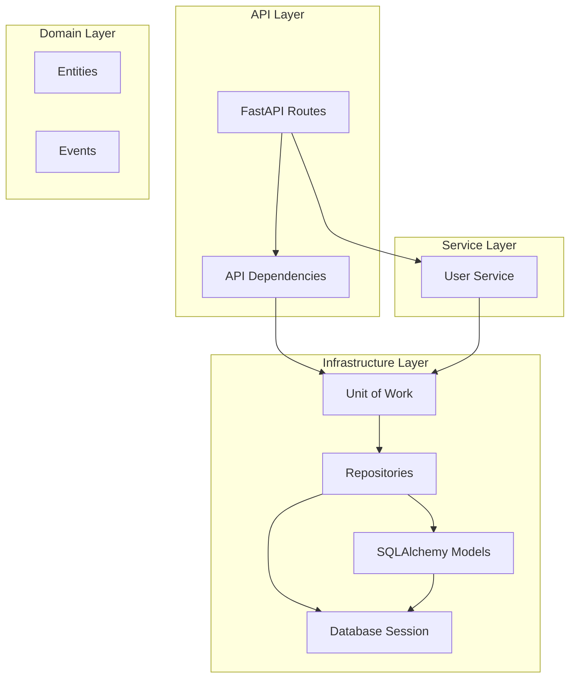

# 🍃 LeafFlow

[](https://www.python.org/downloads/)
[](https://fastapi.tiangolo.com/)
[](https://www.postgresql.org/)
[](LICENSE)

**LeafFlow** — современное REST API приложение, построенное на FastAPI с использованием принципов чистой архитектуры.  
Лаконичное решение для управления данными «от листа до корзины» — быстро, надёжно, легко расширять.

---

## 📋 Содержание

- [Особенности](#-особенности)
- [Технологический стек](#-технологический-стек)
- [Архитектура](#-архитектура)
- [Требования](#-требования)
- [Установка](#-установка)
  - [Локальная установка](#локальная-установка)
  - [Установка через Docker Compose](#установка-через-docker-compose)
- [Конфигурация](#-конфигурация)
- [Запуск](#-запуск)
  - [Локальный запуск](#локальный-запуск)
  - [Запуск через Docker](#запуск-через-docker)
- [Работа с БД](#-работа-с-бд)
  - [Миграции Alembic](#миграции-alembic)
  - [Подключение к БД](#подключение-к-бд)
  - [Деактивация продуктов и очистка корзин](#-деактивация-продуктов-и-очистка-корзин-на-уровне-postgresql)
- [API Documentation](#-api-documentation)
  - [Примеры API запросов](#примеры-api-запросов)
- [Структура проекта](#-структура-проекта)
  - [Ключевые компоненты](#ключевые-компоненты)
- [Разработка](#-разработка)
  - [Добавление нового endpoint](#добавление-нового-endpoint)
  - [Работа с моделями](#работа-с-моделями)
- [Тестирование](#-тестирование)
- [Best Practices](#-best-practices)
- [Contributing](#-contributing)
- [Лицензия](#-лицензия)

---

## ✨ Особенности

- 🚀 **Асинхронная архитектура** — полностью `async/await` с FastAPI и SQLAlchemy 2.0
- 🏗️ **Чистая архитектура** — разделение на слои `domain`, `infrastructure`, `services` и `api`
- 🔄 **Unit of Work паттерн** — управление транзакциями и консистентностью данных
- 📦 **Repository паттерн** — абстракция доступа к данным
- 🗄️ **PostgreSQL** — надёжная реляционная СУБД
- 🔧 **Alembic** — миграции базы данных
- 🐳 **Docker** — контейнеризация для лёгкого развёртывания
- ⚙️ **Pydantic Settings** — типизированная конфигурация через переменные окружения

---

## 🛠 Технологический стек

| Категория        | Технологии                    |
|------------------|------------------------------|
| **Framework**    | FastAPI                      |
| **Language**     | Python 3.12                  |
| **Database**     | PostgreSQL 17                |
| **ORM**          | SQLAlchemy 2.0 (async)       |
| **Migrations**   | Alembic                      |
| **Validation**   | Pydantic v2                  |
| **Server**       | Uvicorn                      |
| **Containerize** | Docker, Docker Compose       |

---

## 🏛 Архитектура

Проект следует принципам **Clean Architecture** и **Domain-Driven Design**.



### Слои приложения

| Слой          | Назначение                              | Примеры                        |
|--------------|------------------------------------------|--------------------------------|
| **API**      | HTTP endpoints, роутинг, валидация       | `api/v1/app/routers/`          |
| **Services** | Бизнес-логика приложения                 | `services/user_service.py`     |
| **Infrastructure** | Работа с БД, внешними сервисами    | `infrastructure/db/`           |
| **Domain**   | Доменные сущности, события, правила      | `domain/entities/`             |

---

## 📦 Требования

- Python: **3.12** или выше  
- PostgreSQL: **17** (можно использовать Docker)  
- `pip`: для управления зависимостями  
- Docker / Docker Compose (опционально, для контейнеризации)

---

## 🚀 Установка

### Локальная установка

Клонируйте репозиторий:

```bash
git clone https://github.com/Mist3s/leaf-flow.git
cd leaf-flow
```

Создайте виртуальное окружение:

```bash
python -m venv .venv
```

Активируйте виртуальное окружение:

```bash
# macOS/Linux:
source .venv/bin/activate

# Windows PowerShell:
.venv\Scripts\Activate.ps1

# Windows CMD:
.venv\Scriptsctivate.bat
```

Установите зависимости:

```bash
pip install -e .
```

Примечание: флаг `-e` устанавливает проект в режиме разработки (*editable mode*).

### Установка через Docker Compose

```bash
docker-compose up -d
```

(при наличии настроенного `docker-compose.yml` в корне проекта)

---

## ⚙️ Конфигурация

Приложение использует переменные окружения для конфигурации.  

Создайте файл `.env` в корне проекта:

```bash
cp .env.example .env
```

### Параметры конфигурации

Отредактируйте файл `.env`:

```env
# --- База данных ---
POSTGRES_USER=leafflow_user
POSTGRES_PASSWORD=strong_password_here
POSTGRES_DB=leafflow_db
DB_HOST=localhost
DB_PORT=5432
```

#### Таблица параметров

| Параметр            | Описание                     | По умолчанию | Обязателен |
|---------------------|-----------------------------|--------------|-----------|
| `POSTGRES_USER`     | Имя пользователя PostgreSQL  | –            | ✅         |
| `POSTGRES_PASSWORD` | Пароль пользователя          | –            | ✅         |
| `POSTGRES_DB`       | Имя базы данных             | –            | ✅         |
| `DB_HOST`           | Хост базы данных            | `localhost`  | ✅         |
| `DB_PORT`           | Порт базы данных            | `5432`       | ✅         |

Важно: для Docker Compose используйте `DB_HOST=db-leaf-flow`.

---

## 🏃 Запуск

### Локальный запуск

Запустите PostgreSQL (если не используете локально установленный сервер):

```bash
docker-compose up -d db-leaf-flow
```

Примените миграции (при первом запуске):

```bash
alembic upgrade head
```

Запустите приложение:

```bash
python -m leaf_flow
```

По умолчанию приложение доступно по адресу:  
`http://localhost:8000`

### Запуск через Docker

Сборка образа:

```bash
docker build -t leaf-flow:latest .
```

Запуск контейнера:

```bash
docker run --rm   --env-file .env   -p 8000:8000   leaf-flow:latest
```

Или через Docker Compose:

```bash
docker-compose up -d
```

---

## 🗄️ Работа с БД

### Миграции Alembic

Создать новую миграцию:

```bash
alembic revision --autogenerate -m "описание изменений"
```

Применить миграции:

```bash
alembic upgrade head
```

Откатить миграцию:

```bash
alembic downgrade -1
```

Посмотреть историю миграций:

```bash
alembic history
```

### Подключение к БД

Локальное подключение:

```bash
psql -h localhost -p 5432 -U leafflow_user -d leafflow_db
```

Через Docker:

```bash
docker exec -it <container_id> psql -U leafflow_user -d leafflow_db
```

### 🔒 Деактивация продуктов и очистка корзин (на уровне PostgreSQL)

В проекте реализована автоматическая поддержка консистентности каталога и корзины на уровне базы данных:

- При переводе `products.is_active` из `true` в `false`:
  - все варианты товара (`product_variants`) деактивируются (`is_active=false`);
  - все позиции в корзинах (`cart_items`), связанные с этим товаром, удаляются.

- При переводе `product_variants.is_active` из `true` в `false`:
  - все позиции в корзинах (`cart_items`), связанные с этим вариантом, удаляются;
  - если после этого у товара не осталось активных вариантов — товар автоматически деактивируется.

Данная логика реализована через `AFTER UPDATE` триггеры PostgreSQL и обеспечивает корректное поведение даже при прямых SQL-обновлениях данных (в обход приложения).

---

## 📚 API Documentation

После запуска приложения доступна автоматически генерируемая документация:

- Swagger UI: `http://localhost:8000/docs`
- ReDoc: `http://localhost:8000/redoc`

### Примеры API запросов

#### Создать пользователя

```bash
curl -X POST "http://localhost:8000/api/v1/users/"   -H "Content-Type: application/json"   -d '{
    "email": "user@example.com",
    "name": "John Doe"
  }'
```

Пример ответа:

```json
{
  "id": 1,
  "email": "user@example.com",
  "name": "John Doe"
}
```

---

## 📁 Структура проекта

```txt
leaf-flow/
├── .env.example              # Шаблон переменных окружения
├── .gitignore
├── README.md                 # Документация
├── alembic.ini               # Конфигурация Alembic
├── docker-compose.yml        # Docker Compose конфигурация
├── Dockerfile                # Docker образ приложения
├── pyproject.toml            # Зависимости и метаданные проекта
│
├── migrations/               # Миграции базы данных
│   ├── env.py                # Конфигурация Alembic окружения
│   └── versions/             # Файлы миграций
│
└── src/leaf_flow/            # Исходный код приложения
    ├── __init__.py
    ├── __main__.py           # Точка входа
    ├── app.py                # Инициализация FastAPI приложения
    ├── config.py             # Настройки приложения
    │
    ├── api/                  # API слой
    │   ├── deps.py           # Зависимости FastAPI
    │   └── v1/               # API v1
    │       ├── admin/        # Административные endpoints
    │       ├── app/          # Основные endpoints приложения
    │       │   ├── routers/  # API роутеры
    │       │   └── schemas/  # Pydantic схемы
    │       └── auth/         # Аутентификация
    │
    ├── domain/               # Доменный слой
    │   ├── core/             # Базовые сущности
    │   ├── entities/         # Доменные сущности
    │   ├── events/           # Доменные события
    │   └── externals/        # Внешние интерфейсы
    │
    ├── infrastructure/       # Инфраструктурный слой
    │   └── db/               # Работа с БД
    │       ├── base.py       # Базовый класс моделей
    │       ├── session.py    # Настройка сессии БД
    │       ├── uow.py        # Unit of Work паттерн
    │       ├── models/       # SQLAlchemy модели
    │       └── repositories/ # Репозитории
    │
    └── services/             # Сервисный слой
        └── user_service.py   # Бизнес-логика пользователей
```

---

## Ключевые компоненты

### 🔧 Unit of Work (UoW)

Паттерн для управления транзакциями и координации репозиториев:

```python
# infrastructure/db/uow.py
from dataclasses import dataclass
from sqlalchemy.ext.asyncio import AsyncSession

from .repositories import UserRepository

@dataclass
class UoW:
    session: AsyncSession
    users: UserRepository

    async def commit(self) -> None:
        await self.session.commit()

    async def rollback(self) -> None:
        await self.session.rollback()
```

### 📦 Repository Pattern

Абстракция доступа к данным:

```python
# infrastructure/db/repositories/base.py
from typing import Generic, Type, TypeVar
from sqlalchemy.orm import Session

T = TypeVar("T")

class Repository(Generic[T]):
    def __init__(self, session: Session, model: Type[T]) -> None:
        self.session = session
        self.model = model

    async def get(self, obj_id: int) -> T | None:
        return await self.session.get(self.model, obj_id)

    async def add(self, obj: T) -> T:
        self.session.add(obj)
        return obj
```

---

## 👨‍💻 Разработка

### Установка dev-зависимостей

```bash
pip install -e ".[dev]"
```

### Запуск в режиме разработки

Приложение может запускаться с `reload=True` для hot-reload (см. `__main__.py`):

```bash
python -m leaf_flow
```

### Добавление нового endpoint

1. Создайте Pydantic-схемы в `api/v1/app/schemas/`.
2. Создайте роутер в `api/v1/app/routers/`.
3. Добавьте бизнес-логику в `services/`.
4. Зарегистрируйте роутер в `app.py`:

```python
from fastapi import FastAPI
from leaf_flow.api.v1.app.routers.your_router import router as your_router

def create_app() -> FastAPI:
    app = FastAPI(title="leaf-flow")
    app.include_router(
        your_router,
        prefix="/api/v1/your-resource",
        tags=["your-tag"],
    )
    return app
```

### Работа с моделями

1. Создайте модель в `infrastructure/db/models/`.
2. Импортируйте её в `migrations/env.py` (чтобы Alembic видел модель).
3. Создайте миграцию:

```bash
alembic revision --autogenerate -m "add your_model table"
```

4. Примените миграцию:

```bash
alembic upgrade head
```

---

## 🧪 Тестирование

Установка необходимых пакетов:

```bash
pip install pytest pytest-asyncio httpx
```

Запуск тестов:

```bash
pytest
```

---

## 📝 Best Practices

- ✅ Всегда используйте `async/await` для I/O операций
- ✅ Работайте с БД через паттерн **Unit of Work**
- ✅ Используйте Pydantic-схемы для валидации входящих/исходящих данных
- ✅ Следуйте принципу разделения слоёв (API / Services / Infrastructure / Domain)
- ✅ Создавайте небольшие и хорошо изолированные сервисы с чёткой ответственностью
- ✅ Покрывайте бизнес-логику тестами
- ✅ Избегайте прямой работы с ORM из слоя API — используйте сервисы и репозитории

---

## 🤝 Contributing

Pull Request’ы и предложения приветствуются.

Рекомендуемый процесс:

1. Форкнуть репозиторий
2. Создать ветку для фичи/исправления: `git checkout -b feature/my-feature`
3. Внести изменения + добавить тесты
4. Убедиться, что все тесты проходят: `pytest`
5. Открыть Pull Request

---

## 📄 Лицензия

Проект распространяется под лицензией [MIT](LICENSE).